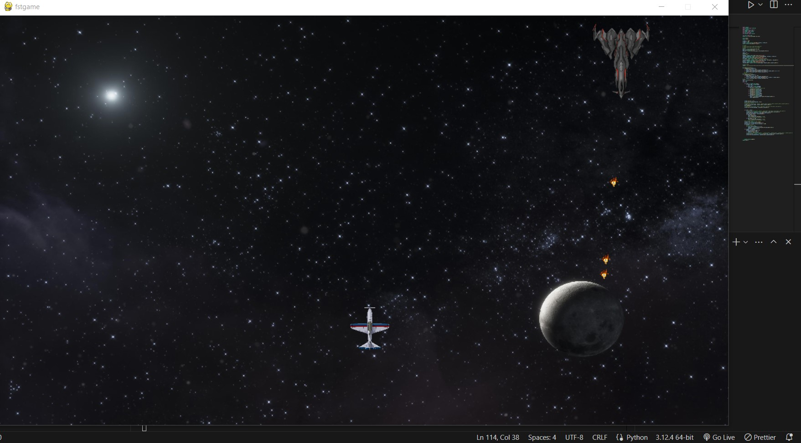
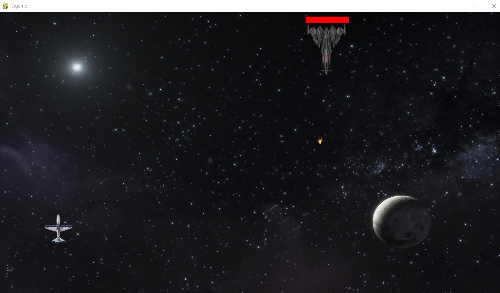
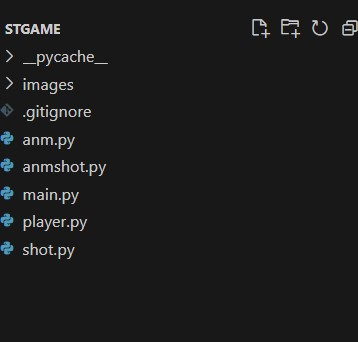
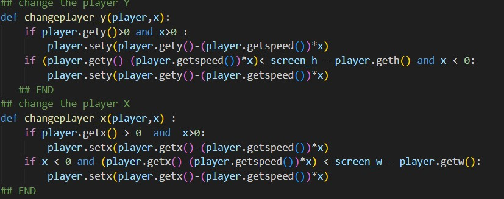
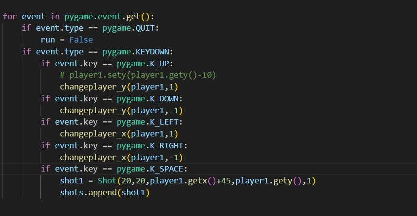
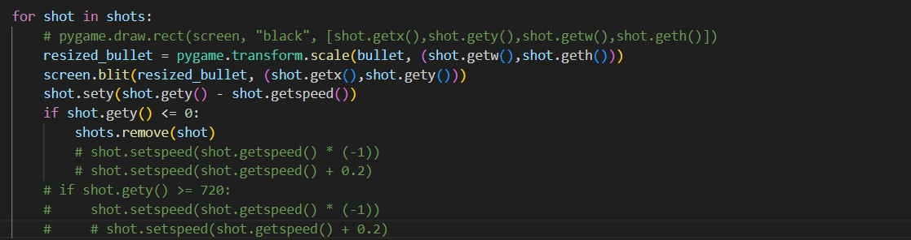
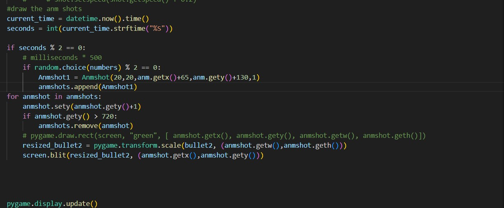

# My 1st Pygame.
# Video From Youtube

[](https://youtu.be/5w4xXKHMCOw)

# To install the project
You can simply install it, or use this command (you'll need Python and Git).
```bash
git clone https://github.com/Amin-doryani/1stpygame
```
## Classes
In this game we have 4 classes Player and is the fighter image ,Shot and it's the bullets of the player,Anm and it's the Bigfighter and Anmshot is Bigfighter Shots.

#

#
this is the classes, and  for evrey class we need w,h,x,y and speed(for the Anm the Speed it's just 1 or -1 just to check if it's on the left or the right and change the to redirect it with help of changepos (image 3)).
#

#
image 3
#

#
1st we set A player Object, Anm object and two lists.. one for the Shots to store the Player shots, and the 2nd for the Anm shots and load all images needed.
2nd we set the game loop.
if the QUIT clicked we quit the game of cours.
if the K_DOWN,up,left,right we change y  or the x of the player by a changeplayer_y and changeplayer_x  function that need the  Player object and and 1 (for the left and up) or -1 (for the right and down).
#

#

#
Every time we click in the space key we create a new bullet object with x and y of the Player object and add it to the shots list (image 5) and drow all shots in the list like in image 6 after checking if the shot it's not in the window (shot.gety()<0) and if it's we remove it from the list and this object (shot) will be deleted bcs there is nothing pointing on it
#

#
# how I display the images!
#
1st I was geting the object  attributes and drawin a rect there with x,y,w,h of the object (like the 1st comment in the image 6) then commented it and draw an image there.
#
# Anmshots !
for the player shots It was easy.. when the space button clicked create a shot add it to list loop in the list change the y of every shot and display them.
but for the Anmshots I don't have a key that will be clicked.. so I did this (image7) 1st I creat a list that have somthing like 198 numbern and  there is just one number that (number % 2 = 0) and it's 2.
then I got the seconds now with help of datetime.. and check if  (seconds % 2 = 0) and if it's.
I got a random number from the numberslist and check if (the number % 2 = 0) then create the shot object and add it to a list then display it... yes it's a chanse of somthing like 0.5% to got 2 from the list.. BUUUUT the idea is that we don't loop every 1s.. we loop a lot and we got a good amonts of shots
#

## To add a Background Sound
1.create a music folder in the stgame .
#
2.add to music a ".wav" sound (u can set the sound name got.wav) .
#
3.got to main.py got to #sounds uncomment line 22 and 23 .
#
4.change the got.wav to the name of the sound on your music folder.


