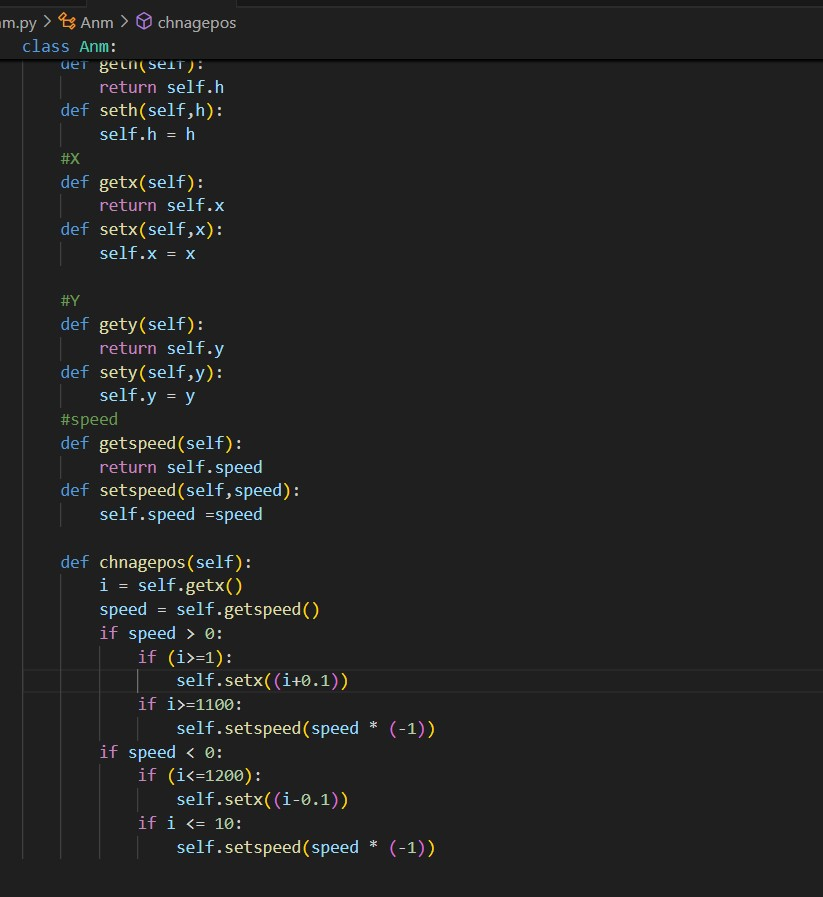

# My 1st Pygame.
## Classes
In this game we have 4 classes Player and is the fighter image ,Shot and it's the bullets of the player,Anm and it's the Bigfighter and Anmshot is Bigfighter Shots.

#
this is the classes, and  fro evrey class we need w,h,x,y and speed(for the Anm the Speed it's just 1 or -1 just to check if it's on the left or the right and change the to redirect it with help of changepos (image 3)).

image 3

#
1st we set A player Object, Anm object and tow lists.. one for the Shots to store the Player shots, and the 2nd for the Anm shots and load all images needed.
2nd we set the game loop.
if the QUIT clicked we quit the game of cours.
if the K_DOWN,up,left,right we change y  or the x of the player by a changeplayer_y and changeplayer_x  function that need the  Player object and and 1 (for the left and up) or -1 (for the right and down).

